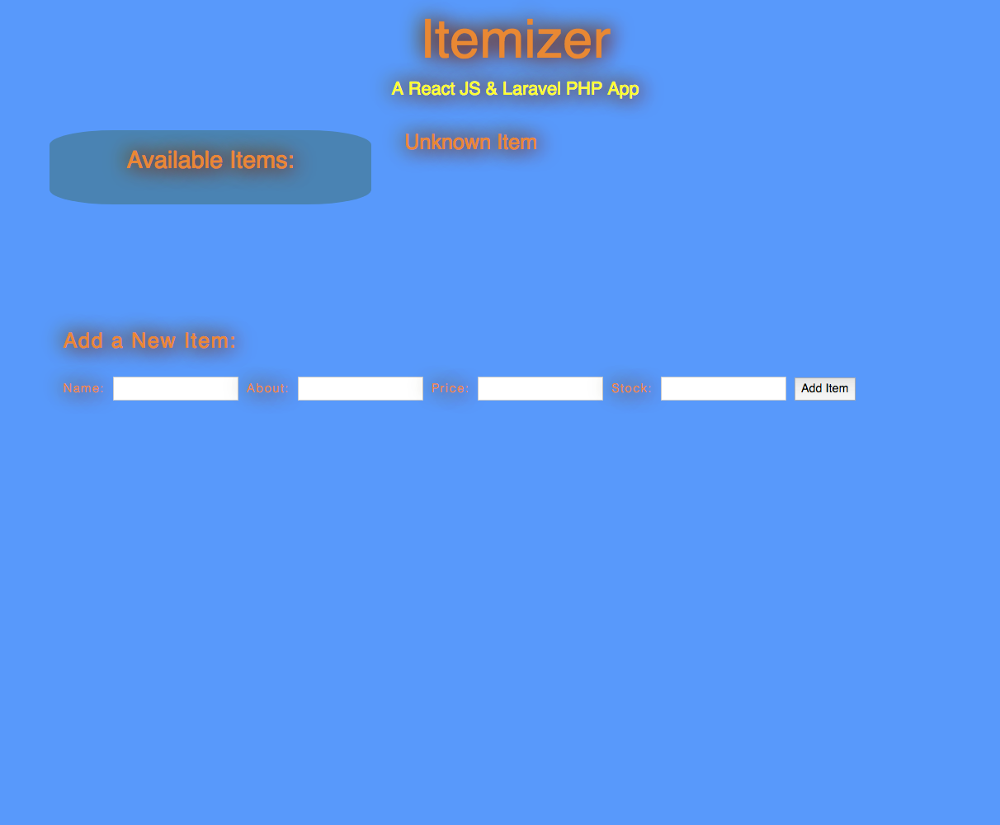

# [iTemizer - WiP](https://react-laravel.herokuapp.com/)

### App made with REACT JS and also Laravel PHP to create a RESTful backend API.
#### This is still a work in progress (WiP), however, to view Heroku deployment please Click App Name Above to View.
 

  

#### Technologies Used:
##### REACT JS
##### Laravel PHP
##### Heroku

#### This WiP (Work in Progress) was created to try to use React JS with Laravel as opposed to Vue JS, which is the front-end that Laravel is typically used with.  While the front-end is being written with React, the RESTful backend still has yet to have an update and delete route for items.
